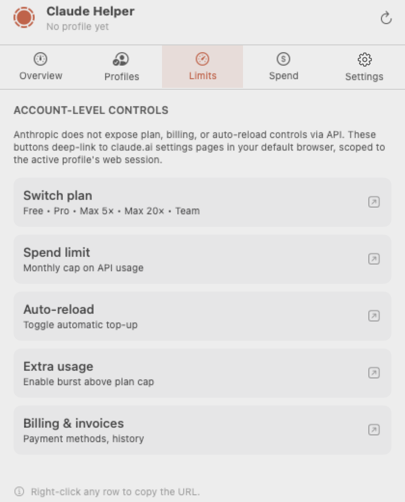

<div align="center">

# Claude Helper

**An unofficial macOS menubar companion for Claude Code.** Three live usage meters at a glance, multi-profile switcher with per-profile claude.ai session isolation, local spend ledger, and deep-links to the settings pages Anthropic doesn't expose via API.

<p>
  <a href="https://github.com/peguesj/claude-code-macos-helper/releases/latest"></a>
  <a href="https://github.com/peguesj/claude-code-macos-helper/actions/workflows/ci.yml"></a>
  <a href="https://github.com/peguesj/claude-code-macos-helper/actions/workflows/pages.yml"></a>
  
  
  <a href="LICENSE"></a>
  <a href="https://github.com/peguesj/claude-code-macos-helper/commits/main"></a>
  
</p>

<p>
  
  
  
  
  
  
</p>


[**Marketing site →**](https://peguesj.github.io/claude-code-macos-helper/) &nbsp;·&nbsp; [**Releases →**](https://github.com/peguesj/claude-code-macos-helper/releases) &nbsp;·&nbsp; [**Issues →**](https://github.com/peguesj/claude-code-macos-helper/issues)

</div>

---

## Table of contents

- [Why](#why)
- [Features](#features)
- [Screenshots](#screenshots)
- [Install](#install)
  - [From release (recommended)](#from-release-recommended)
  - [Gatekeeper note (no Apple Dev account)](#gatekeeper-note-no-apple-dev-account)
- [How it bootstraps](#how-it-bootstraps)
- [Profiles & session switching](#profiles--session-switching)
- [Architecture](#architecture)
- [Build from source](#build-from-source)
- [Project layout](#project-layout)
- [Releases & auto-update](#releases--auto-update)
- [Contributing](#contributing)
- [Roadmap](#roadmap)
- [License](#license)

## Why

You have a Claude Max plan **and** a Team workspace. You hit the session cap on one, want to flip to the other, glance at how much Sonnet you have left this window, and maybe nudge your auto-reload budget — all without leaving your editor. The official tools are great but cloud-only, and there's no ambient surface.

Claude Helper lives in your menubar. It shows three live meters at all times, holds multiple Claude profiles (each with its own API key or OAuth token, claude.ai cookie isolation, and CLI config), and deep-links you to the right place when an account-level setting needs the web console.

## Features

- **Three inline meters** — today / all-models (wk) / sonnet (wk) — visible at a glance next to a Claude C-arc icon. Week meters show `<used> / <limit>` with a colour-coded percentage badge (green / yellow / red).
- **JSONL-based telemetry** — a lightweight Python daemon reads Claude Code's own transcript files (`~/.claude/projects/**/*.jsonl`) to produce accurate token counts. No API key required, no outbound HTTP. Incremental byte-offset scanning means re-reads are O(new bytes).
- **Correct week window** — aggregates Tue 00:00 → Mon 23:59, matching claude.ai's quota reset cadence, not a rolling 7-day window.
- **Multi-profile switcher** — Max personal, Team org, sandbox. Switching swaps the active API key, the claude.ai cookies, and the local `~/.claude/settings.json` profile atomically.
- **Auto-bootstrap on first launch** — reads `~/.claude/settings.json`, then `ANTHROPIC_API_KEY`, then the macOS Keychain `Claude Code-credentials` (OAuth) item, creating a "Default" profile if any are present.
- **Session capture & restore** — sign into claude.ai once per profile; subsequent switches restore cookies without re-auth via `WKWebsiteDataStore`.
- **Spend ledger** — GRDB / SQLite store, daily aggregates, linear month-end forecast. UserNotifications alert when the projection crosses 80% of your monthly limit.
- **Deep links** — buttons that open the right claude.ai settings page in your default browser, scoped to the active profile's session.
- **Sparkle auto-updates** — EdDSA-signed appcast.
- **AppleScript bridge** — automate profile switching from Shortcuts, Hammerspoon, shell scripts.
- **No keychain reuse** — each profile's secrets live under their own service tag, scoped to the bundle ID + profile UUID.

## Screenshots

| Menubar | Overview | Profiles | Limits | Spend |
|---|---|---|---|---|
|  |  |  |  |  |

> Screenshots are auto-generated by the in-app harness (`make screenshots`) — they reflect the current build's actual rendering, not Figma mocks.

## Install

### From release (recommended)

```bash
# Download the latest universal .app
gh release download --repo peguesj/claude-code-macos-helper --pattern 'ClaudeHelper-*.zip'

unzip ClaudeHelper-*.zip
mv ClaudeHelper.app /Applications/
xattr -dr com.apple.quarantine /Applications/ClaudeHelper.app   # see Gatekeeper note
open /Applications/ClaudeHelper.app
```

### Gatekeeper note (no Apple Dev account)

This project is **ad-hoc signed** because the maintainer doesn't run an Apple Developer account. macOS Gatekeeper will refuse to open it on first launch with "Apple could not verify ClaudeHelper is free of malware." That's expected for unsigned apps.

Two paths to open it:

```bash
# Option A — strip the quarantine attribute (fastest)
xattr -dr com.apple.quarantine /Applications/ClaudeHelper.app
open /Applications/ClaudeHelper.app
```

```text
# Option B — right-click "Open" through Finder
1. Right-click ClaudeHelper.app in /Applications
2. Choose "Open" (NOT double-click)
3. Click "Open" in the warning dialog — macOS remembers your choice
```

Source-built copies (`make install`) skip the quarantine bit entirely because they aren't downloaded from the internet.

## How it bootstraps

On first launch, Claude Helper looks for credentials in this order and creates a "Default" profile from the first one it finds:

1. `~/.claude/settings.json` → `env.ANTHROPIC_API_KEY`
2. `ANTHROPIC_API_KEY` environment variable
3. macOS Keychain item `Claude Code-credentials` (the OAuth token Claude Code Max plans use; service `Claude Code-credentials`, JSON body with `claudeAiOauth.accessToken`)

If none are found, the popover shows an empty "Add your first profile" state. Adding manually accepts any `sk-ant-…` key or OAuth bearer.

> **Keychain ACL note:** the OAuth keychain item is ACL-restricted to the Claude Code CLI's signing identity. When Claude Helper (different signing identity) tries to read it, macOS will surface a keychain access prompt on first run. Approve once and the bootstrap completes; deny and the popover shows the empty state until you add a profile manually.

## Profiles & session switching

A **profile** bundles three things:

| Thing | Lives in | Scope |
|---|---|---|
| Anthropic credential (API key or OAuth access token) | Keychain (`io.pegues.ClaudeHelper.<profile-uuid>`) | API calls + telemetry |
| claude.ai cookies | `WKWebsiteDataStore(forIdentifier: profileUUID)` | Web console sessions |
| CLI config | `~/.claude/settings.json` (rewritten on switch) | `claude` CLI usage |

When you switch profiles:

1. Active profile's secrets are loaded from Keychain.
2. `env.ANTHROPIC_API_KEY` in `~/.claude/settings.json` is rewritten atomically (`tmp` + `rename(2)`).
3. The target profile's `WKWebsiteDataStore` activates so any embedded claude.ai webview uses those cookies.
4. `ClaudeHelperProfileChanged` distributed notification posts so listening shells/scripts can re-source env.

## Architecture

```
 LaunchAgent (120 s)
  └─ compute_usage_live.py ──► ~/.claude/usage-live.json
       reads ~/.claude/projects/**/*.jsonl                        ◄─── ground truth
       byte-offset cache → only new bytes re-read                      token source
       tracks all-models + sonnet separately
       Tue–Mon calendar week window

 ┌─────────────────────────────────────────────────┐
 │ TelemetryService (@MainActor, 60 s fallback)    │
 │  FileSystemWatcher (kqueue DispatchSource)      │
 │   watches usage-live.json  ──► debounce 500 ms  │
 │  LocalSnapshotReader.read(plan:)                │
 │   1. usage-live.json  (daemon, < 10 min stale)  │
 │   2. stats-cache.json (secondary fallback)      │
 │   3. usage-snapshots/ (per-session fallback)    │
 │   └→ @Published TelemetrySnapshot               │
 └─────────────┬───────────────────────────────────┘
               ▼
┌──────────────────────────────────────────────────────────────┐
│ NSStatusItem (custom NSView, 22 pt tall)                     │
│   ├── Claude C-arc icon (NSBezierPath, 16 pt)                │
│   └── 3 inline horizontal capsule meters (28×5 pt each)      │
│                                                              │
│ ┌──────────────────────────────────────────────────────┐     │
│ │ NSPopover (SwiftUI content, 420×520 pt)              │     │
│ │   Header • Tabs (Overview / Profiles / Limits /      │     │
│ │           Spend / Settings) • Body                   │     │
│ └─┬──────────────┬────────────┬──────────────────────┬─┘     │
│   │              │            │                      │       │
│ ProfileStore  SpendLedger  DeepLinks           UpdaterBridge  │
│  │ │ │       (GRDB)       (NSWorkspace)        (Sparkle 2.x) │
│  │ │ └── SessionStore (WKWebsiteDataStore per profile UUID)  │
│  │ └──── CLIConfigWriter (~/.claude/settings.json atomic)    │
│  └────── Keychain (one item per profile)                     │
│  ▲                                                           │
│ ProfileBootstrap (first-launch credential discovery)         │
│                                                              │
│ ┌──────────────────────────────────────────────────┐         │
│ │ Forecaster — linear extrapolation,               │         │
│ │  posts UNUserNotificationCenter alerts           │         │
│ │  when projection crosses 0.5 → 0.8 → 1.0 limit  │         │
│ └──────────────────────────────────────────────────┘         │
└──────────────────────────────────────────────────────────────┘
```

The entire app is **one SPM executable target** packaged into a `.app` bundle by `scripts/build-app.sh`. No `.xcodeproj` is checked in — open with `xed .` if you want Xcode tooling.

## Build from source

**Prerequisites**: macOS 15+, Xcode 16+, Swift 6.0, GNU make.

```bash
git clone https://github.com/peguesj/claude-code-macos-helper.git
cd claude-code-macos-helper

make build              # debug binary at .build/debug/ClaudeHelper
make run                # run debug binary
make app CONFIG=release # build .app at dist/ClaudeHelper.app
make test               # XCTest suite
make screenshots        # render docs/screenshots/*.png from popover state
make install            # build + copy to /Applications + launch
```

If you don't have an Apple Developer ID (most contributors won't), the `.app` is ad-hoc signed by `codesign --force --deep --sign -`. Gatekeeper still flags it for downloaded copies — see [Gatekeeper note](#gatekeeper-note-no-apple-dev-account).

To work in Xcode:

```bash
xed .                   # opens Package.swift in Xcode
# Build & Run with Cmd-R
```

## Project layout

```
claude-code-macos-helper/
├── Package.swift                       # SPM manifest, macOS 15 / Swift 6
├── Sources/ClaudeHelper/
│   ├── App.swift                       # @main, NSApplication setup
│   ├── AppDelegate.swift               # status item + popover wiring
│   ├── Menubar/
│   │   ├── StatusItemController.swift  # NSStatusItem owner + context menu
│   │   └── MenubarMeterView.swift      # custom NSView: C-arc + 3 meters
│   ├── Popover/
│   │   ├── PopoverContentView.swift    # SwiftUI tab container
│   │   ├── OverviewTab.swift           # three labeled meters + forecast
│   │   ├── ProfilesTab.swift           # list + add-profile sheet
│   │   ├── LimitsTab.swift             # deep-link rows
│   │   ├── SpendTab.swift              # Swift Charts bar chart
│   │   └── SettingsTab.swift           # AppStorage-backed prefs
│   ├── Models/
│   │   ├── UsageMeter.swift            # TelemetryMeter, TelemetrySnapshot
│   │   ├── Plan.swift                  # Plan.Kind enum
│   │   └── Profile.swift               # Profile struct + NSColor(hex:)
│   ├── Services/
│   │   ├── TelemetryService.swift      # @MainActor, 60s fallback poll + FSEvents
│   │   ├── LocalSnapshotReader.swift   # usage-live.json → stats-cache → snapshots
│   │   ├── FileSystemWatcher.swift     # kqueue DispatchSource, 500ms debounce
│   │   ├── AnthropicUsageClient.swift  # actor, URLSession (optional / fallback)
│   │   ├── KeychainHelper.swift        # generic-password CRUD
│   │   ├── ProfileStore.swift          # ObservableObject, persistence
│   │   ├── ProfileBootstrap.swift      # first-launch credential discovery
│   │   ├── SessionStore.swift          # per-profile WKWebsiteDataStore
│   │   ├── CLIConfigWriter.swift       # atomic ~/.claude/settings.json
│   │   ├── SpendLedger.swift           # GRDB usage_samples table
│   │   └── Forecaster.swift            # alerts via UNUserNotificationCenter
│   └── Util/
│       ├── BrandColors.swift           # design token → SwiftUI Color
│       ├── DeepLinks.swift             # NSWorkspace.open shortcuts
│       ├── Logging.swift               # os.Logger wrapper
│       ├── NotificationDispatcher.swift
│       ├── UpdaterBridge.swift         # Sparkle, LaunchAtLogin
│       ├── ScreenshotRenderer.swift    # CLAUDEHELPER_SCREENSHOT_MODE=1
│       └── Bundle+Version.swift
├── Tests/ClaudeHelperTests/            # XCTest suite (ratio math, hex, deep-links)
├── scripts/
│   ├── build-app.sh                    # SPM build → .app bundle + Sparkle.framework
│   ├── generate_icon.py                # regenerate AppIcon PNGs (requires rsvg-convert)
│   └── release.sh                      # tag + gh release with artifact
├── ~/.claude/hooks/
│   └── compute_usage_live.py           # JSONL daemon (not in repo; installed at first run)
├── ~/Library/LaunchAgents/
│   └── io.pegues.claudeusage.plist     # runs daemon every 120 s
├── docs/                               # GitHub Pages root
│   ├── index.html                      # marketing site (from design handoff)
│   ├── assets/colors_and_type.css      # shared design tokens
│   └── screenshots/                    # README + marketing site images
├── .github/workflows/
│   ├── ci.yml                          # macOS-15 build + test + .app artifact
│   └── pages.yml                       # deploy docs/ to GitHub Pages
└── Makefile                            # build / run / test / app / install
```

## Releases & auto-update

```bash
./scripts/release.sh v0.1.1
```

This builds a universal binary (arm64 + x86_64), ad-hoc signs the bundle, zips it, tags, pushes, and creates a GitHub release with the artifact attached. Sparkle pulls `https://peguesj.github.io/claude-code-macos-helper/appcast.xml` (EdDSA-signed) for in-app update prompts.

## Contributing

Open an issue first for anything bigger than a typo. PRs welcome. CI runs `swift test`, `swift build -c release`, and a screenshot diff. Style: 4-space indent, brace-on-same-line, `@MainActor` for any class that touches UI.

The `develop/browser-automation` branch is parked as the alternative to deep-links (form-driving claude.ai). It's not on the roadmap unless multiple users ask.

## Roadmap

| Version | Status | Highlights |
|---|---|---|
| v0.1.0 — Foundation | ✅ | SPM scaffold, menubar meters, profiles, spend ledger, Sparkle |
| v0.2.0 — Live telemetry | ✅ | FSEvents watcher, AppIcon, corrected limits, stats-cache primary |
| v0.3.0 — Accurate JSONL telemetry | ✅ | JSONL daemon, Tue–Mon week window, 240M/130M limits, % badges |
| v0.4.0 — Zero outbound HTTP | ⏳ | Strip `AnthropicUsageClient` + Keychain API-key path; session meter %; signed GitHub release |

Next: removing the `AnthropicUsageClient` makes the app fully local — no outbound HTTP, no ATS surface, and no Keychain ACL prompts on dev builds. Session meter percentage via JSONL timestamp delta heuristic (5 h rate-window) is also planned.

## License

MIT — see [LICENSE](LICENSE).

---

<div align="center">

<sub>Not affiliated with Anthropic. Claude and the Claude wordmark are trademarks of Anthropic, PBC.</sub>

</div>
