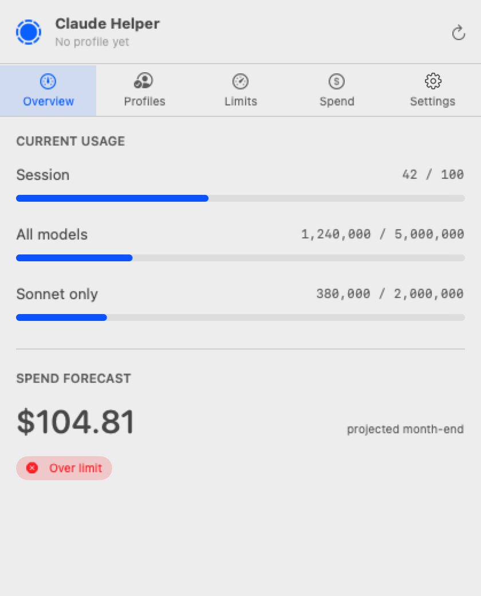
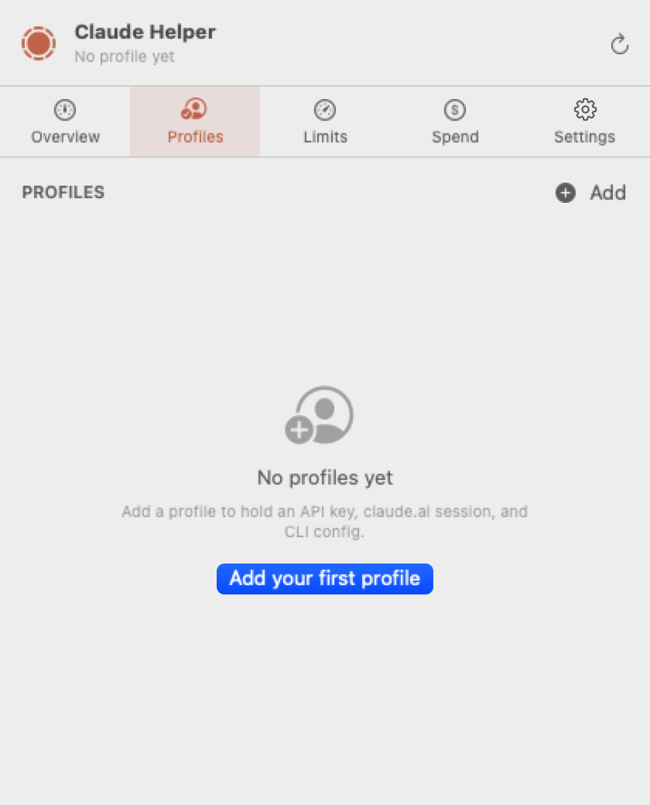
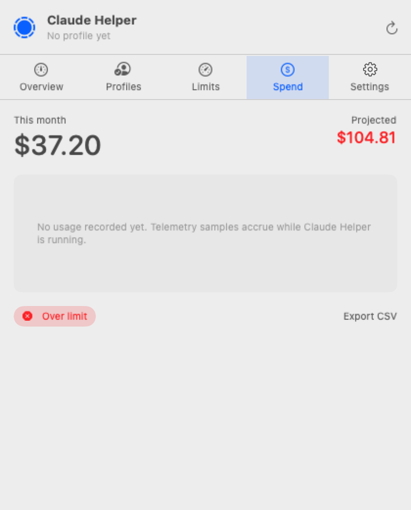

<div align="center">

# Claude Helper

**A macOS menubar companion for managing Claude usage, profiles, and spend.**

[](https://github.com/peguesj/claude-code-macos-helper/releases/latest)
[](https://github.com/peguesj/claude-code-macos-helper/actions)
[](https://swift.org)
[](https://www.apple.com/macos/)
[](LICENSE)
[](https://github.com/peguesj/claude-code-macos-helper/commits/main)
[](https://peguesj.github.io/claude-code-macos-helper/)


</div>

---

## Table of contents

- [Why](#why)
- [Features](#features)
- [Screenshots](#screenshots)
- [Install](#install)
- [Configure](#configure)
- [Profiles & session switching](#profiles--session-switching)
- [Architecture](#architecture)
- [Build from source](#build-from-source)
- [Releases & auto-update](#releases--auto-update)
- [Roadmap](#roadmap)
- [Contributing](#contributing)
- [License](#license)

## Why

You have a Claude Max plan **and** a Team workspace. You hit the session limit on one, want to flip to the other, glance at how much Sonnet you have left this window, and maybe nudge your auto-reload budget — all without leaving your editor. The official tools are great but they're cloud-only, and there's no at-a-glance ambient surface.

Claude Helper lives in your menubar. It shows three live meters at all times, holds multiple Claude profiles (each with its own API key, claude.ai session, and CLI config), and deep-links you to the right place when an account-level setting needs the web console.

## Features

- **Three inline usage meters** — session, all-models, sonnet-only — visible at a glance next to the Claude icon.
- **Multi-profile switcher** — Max personal, Team org, sandbox, whatever you need. Switching swaps the active API key (`ANTHROPIC_API_KEY`), the claude.ai web session cookies, and the local `~/.claude/settings.json` profile.
- **Session capture & restore** — log into claude.ai once per profile; subsequent switches restore cookies without re-auth.
- **Spend ledger** — GRDB/SQLite store with daily aggregates and linear forecast to month-end. Notification when projected spend crosses 80% of your limit.
- **Deep links to claude.ai settings** — plan, billing, spend limit, auto-reload — opened in your default browser with the right path.
- **AppleScript bridge** — automate profile switching from Shortcuts, Hammerspoon, or shell scripts.
- **Sparkle auto-updates** — EdDSA-signed appcast, in-app update prompts.
- **No keychain reuse** — each profile's secrets live in its own keychain item, scoped to bundle ID and profile UUID.

## Screenshots

| Menubar | Overview | Profiles | Spend |
|---|---|---|---|
|  |  |  |  |

## Install

### From release (recommended)

```bash
# Download the latest release
gh release download --repo peguesj/claude-code-macos-helper \
  --pattern 'ClaudeHelper-*.zip'

unzip ClaudeHelper-*.zip
mv ClaudeHelper.app /Applications/
open /Applications/ClaudeHelper.app
```

### From source

```bash
git clone https://github.com/peguesj/claude-code-macos-helper.git
cd claude-code-macos-helper
make install
```

Requires macOS 15+, Xcode 16+, Swift 6.

## Configure

On first launch Claude Helper creates `~/Library/Application Support/ClaudeHelper/` and walks you through adding your first profile:

1. Name the profile (e.g. `personal-max`)
2. Paste an Anthropic API key (stored in Keychain, never on disk)
3. Optionally sign in to claude.ai inside the embedded `WKWebView` to capture session cookies

Subsequent profiles are added the same way. The active profile shows as a chip in the popover header.

## Profiles & session switching

A **profile** bundles three things:

| Thing | Lives in | Scope |
|---|---|---|
| Anthropic API key | Keychain (`io.pegues.ClaudeHelper.<profile-uuid>`) | API calls + telemetry |
| claude.ai cookies | `WKWebsiteDataStore` per profile | Web console sessions |
| CLI config | `~/.claude/settings.json` (rewritten on switch) | `claude` CLI usage |

When you switch profiles the helper:

1. Loads the target profile's secrets from Keychain
2. Updates the `env.ANTHROPIC_API_KEY` block in `~/.claude/settings.json` (atomic write)
3. Activates the target profile's `WKWebsiteDataStore` so any embedded claude.ai webview uses those cookies
4. Posts a `ClaudeHelperProfileChanged` distributed notification (so any listening shells/scripts can re-source env)

## Architecture

```
┌────────────────────────────────────────────────────────────┐
│ NSStatusItem (custom NSView)                               │
│   ├── Claude C-icon (NSImage, template)                    │
│   └── 3 inline meters (session / all-models / sonnet)      │
│           ▲                                                │
│           │ TelemetryService.published                     │
│           │                                                │
│ ┌─────────┴────────────────────────────────────────┐       │
│ │ NSPopover (SwiftUI content)                      │       │
│ │   Tabs: Overview / Profiles / Limits / Spend /   │       │
│ │         Settings                                 │       │
│ └────┬──────────────┬────────────┬─────────────────┘       │
│      │              │            │                         │
│  ProfileStore   SpendLedger   DeepLinks                    │
│   │  │  │       (GRDB)       (NSWorkspace.open)            │
│   │  │  └─ SessionStore (WKWebsiteDataStore per profile)   │
│   │  └──── CLIConfigWriter (~/.claude/settings.json)       │
│   └─────── Keychain (one item per profile)                 │
│      │                                                     │
│ ┌────▼──────────────────────────────────────────┐          │
│ │ TelemetryService (actor, 60s poll)            │          │
│ │   AnthropicUsageClient                        │          │
│ │     ├ /v1/organizations/usage_report/messages │          │
│ │     └ /v1/organizations/cost_report           │          │
│ └───────────────────────────────────────────────┘          │
└────────────────────────────────────────────────────────────┘
```

The whole app is one SPM executable target packaged into a `.app` bundle by `scripts/build-app.sh`. No `.xcodeproj` checked in — open with `xed .` if you want Xcode tooling.

## Build from source

```bash
make build          # debug
make run            # run debug binary
make app CONFIG=release   # produce dist/ClaudeHelper.app
make test
make screenshots    # render docs/screenshots/*.png from popover state
```

## Releases & auto-update

```bash
./scripts/release.sh v0.1.0
```

This builds a universal binary, ad-hoc signs the bundle, zips it, tags, pushes, and creates a GitHub release with the artifact attached. Sparkle pulls `https://peguesj.github.io/claude-code-macos-helper/appcast.xml` (EdDSA-signed) for in-app update prompts.

## Roadmap

| Wave | Status | Stories |
|---|---|---|
| 1 — Foundation | ✅ | CMH-1 … CMH-4 |
| 2 — Menubar shell | ✅ | CMH-5 … CMH-8 |
| 3 — Profile system | ✅ | CMH-9 … CMH-12 |
| 4 — Settings + spend | ✅ | CMH-13 … CMH-16 |
| 5 — Polish & ship | ✅ | CMH-17 … CMH-20 |

Browser-automation alternative (form-driving against claude.ai) lives on the `develop/browser-automation` worktree branch — parked for future evaluation.

## Contributing

Open an issue first for anything bigger than a typo. PRs welcome; we run `swift test`, `swift format lint`, and a screenshot diff check in CI.

## License

MIT — see [LICENSE](LICENSE).
